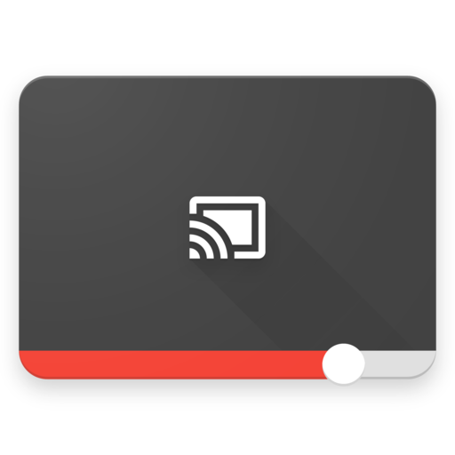

[  ](https://bintray.com/pierfrancescosoffritti/maven/android-youtube-player%3Acore/_latestVersion)
[  ](https://bintray.com/pierfrancescosoffritti/maven/android-youtube-player%3Achromecast-sender/_latestVersion)
[  ](https://android-arsenal.com/details/1/4322)

[](https://twitter.com/intent/tweet?text=A%20new%20YouTube%20Player%20library%20for%20Android,%20stable%20and%20customizable&url=https://github.com/PierfrancescoSoffritti/android-youtube-player&via=PierfrancescoSo&hashtags=opensource,youtubeplayer,androiddev)


The android-youtube-player library is a stable and customizable open source YouTube player for Android. It provides a simple View that can be easily integrated in every Activity/Fragment.

The interaction with YouTube is based on the [IFrame Player API](https://developers.google.com/youtube/iframe_api_reference), running inside of a WebView, therefore the YouTube app is not required on the user's device.

The web UI of the IFrame Player player is hidden. Instead, a native UI built on top of Android is used to interact with the player, providing a native experience to the users.

The UI of the player is 100% customizable. [The default UI can be changed](#playeruicontroller), to show and hide new views, or can be [completely replaced by a custom UI](#create-your-own-custom-ui).

This library also provides a [Chromecast YouTube player](#chromecast-extension-library), that you can use to cast YouTube videos from your app to a Chromecast device.

## Why does this library exist?
This library has been developed out of necessity. The official library provided by Google to integrate YouTube videos in Android apps is the [YouTube Android Player API](https://developers.google.com/youtube/android/player/). I've found the official library to be quite buggy ([some bugs are 5+ years old](https://code.google.com/p/gdata-issues/issues/detail?id=4395)) and lacking in support from Google. It was quite unreliable and therefore unusable in production.

This, added to its limited options for customization and lack of Chromecast support, lead me to the development of this open source library.

A lengthier explanation to why you may want to consider using an alternative to the official YouTube player is written in [this Medium post](https://medium.com/@soffritti.pierfrancesco/how-to-play-youtube-videos-in-your-android-app-c40427215230).

---

A list of published apps that are using this library: ([let me know](https://github.com/PierfrancescoSoffritti/android-youtube-player/issues) if you want to add your app to this list)

- [Shuffly](https://play.google.com/store/apps/details?id=com.pierfrancescosoffritti.shuffly)
- [Top music charts - Billboard](https://play.google.com/store/apps/details?id=com.spians.music.billboard)
- [Mobile Movie Database](https://play.google.com/store/apps/details?id=com.tmdb.themoviedatabase)
- [Curated](https://play.google.com/store/apps/details?id=com.rockspin.weaveapp)


# Table of Contents (Core)
1. [Sample app](#sample-app)
2. [Download](#download)
    1. [Core](#core)
    2. [Chromecast](#chromecast)
3. [Quick start](#quick-start)
4. [YouTubePlayerView](#youtubeplayerview)
    1. [Initialization](#initialization)
    2. [IFramePlayerOptions](#iframeplayeroptions)
    3. [Full screen](#full-screen)
    4. [UI](#ui)
    5. [Release the YouTubePlayerView](#release-the-youtubeplayerview)
    6. [LifecycleObserver](#lifecycleobserver)
5. [YouTubePlayer](#youtubeplayer)
    1. [Load Play and Pause videos](#load-play-and-pause-videos)
    2. [Events](#events)
    3. [The onReady event](#the-onready-event)
    4. [Player state](#player-state)
    5. [YouTubePlayerTracker](#youtubeplayertracker)
6. [YouTubePlayerListener](#youtubeplayerlistener)
7. [PlayerUIController](#playeruicontroller)
    1. [Show video title](#show-video-title)
    2. [Live videos](#live-videos)
    3. [Custom actions](#custom-actions)
8. [Menu](#menu)
    1. [YouTubePlayerMenu](#youtubeplayermenu)
    2. [DefaultYouTubePlayerMenu](#defaultyoutubeplayermenu)
    3. [MenuItem](#menuitem)
9. [Create your own custom UI](#create-your-own-custom-ui)
10. [Network events](#network-events)
11. [Chromecast support](#chromecast-support)
12. [Useful info](#useful-info)
    1. [Hardware acceleration](#hardware-acceleration)
    2. [Play YouTube videos in the background](#play-youtube-videos-in-the-background)
    3. [minSdk](#minsdk)

# Table of Contents (Chromecast)
1. [Chromecast extension library](#chromecast-extension-library)
2. [Quick start](#quick-start-chromecast)
    1. [Download extra dependencies](#download-extra-dependencies)
    2. [Sender](#sender)
    3. [Receiver](#receiver)
    4. [Registration](#registration)
    5. [Hosting the Chromecast receiver](#hosting-the-chromecast-receiver)


# Sample app
This repository has two sample modules that show how to use different functionalities of the library. One [sample module for the core library](./core-sample-app/) and [one sample module for the Chromecast extension](./chromecast-sender-sample-app).

You can download the apks of the two sample app [here (core)](./core-sample-app/apk) and [here (chromecast)](./chromecast-sender-sample-app/apk), or on the PlayStore.

core:

<a href='https://play.google.com/store/apps/details?id=com.pierfrancescosoffritti.aytplayersample&pcampaignid=MKT-Other-global-all-co-prtnr-py-PartBadge-Mar2515-1'>
    
</a>

chromecast:

<a href='https://play.google.com/store/apps/details?id=com.pierfrancescosoffritti.cyplayersample&pcampaignid=MKT-Other-global-all-co-prtnr-py-PartBadge-Mar2515-1'>
    
</a>

Having the sample apps installed is a good way to be notified of new releases. Although watching this repository will allow GitHub to email you whenever a new release is published.

# Download
The Gradle dependency is available via [jCenter](https://bintray.com/pierfrancescosoffritti/maven). jCenter is the default Maven repository used by Android Studio.

The minimum API level supported by this library is API 17.

### Core
The *core* module contains the YouTube Player. It's all you need to play YouTube videos in your app.
```
dependencies {
  implementation 'com.pierfrancescosoffritti.androidyoutubeplayer:core:9.0.0'
}
```

### Chromecast
The *chromecast-sender* module is an optional extension library for the *core* module. Use this if you need to cast YouTube videos from your app to a Chromecast device.
```
dependencies {
  implementation 'com.pierfrancescosoffritti.androidyoutubeplayer:core:9.0.0'
  implementation 'com.pierfrancescosoffritti.androidyoutubeplayer:chromecast-sender:0.16'

  implementation 'org.jetbrains.kotlin:kotlin-stdlib-jdk7:1.3.0'
}
```

# Quick start
In order to start using the player you need to add a [YouTubePlayerView](#youtubeplayerview) to your layout

```xml
<LinearLayout
    xmlns:android="http://schemas.android.com/apk/res/android"
    android:layout_width="match_parent"
    android:layout_height="match_parent"
    android:orientation="vertical" >

    <com.pierfrancescosoffritti.androidyoutubeplayer.player.YouTubePlayerView
        android:id="@+id/youtube_player_view"
        android:layout_width="match_parent"
        android:layout_height="wrap_content"/>
</LinearLayout>
```

Get a reference to the `YouTubePlayerView` in your code and initialize it

```java
YouTubePlayerView youtubePlayerView = findViewById(R.id.youtube_player_view);
getLifecycle().addObserver(youtubePlayerView);

youtubePlayerView.initialize(new YouTubePlayerInitListener() {
    @Override
    public void onInitSuccess(@NonNull final YouTubePlayer initializedYouTubePlayer) {
        initializedYouTubePlayer.addListener(new AbstractYouTubePlayerListener() {
            @Override
            public void onReady() {
                String videoId = "6JYIGclVQdw";
                initializedYouTubePlayer.loadVideo(videoId, 0);
            }
        });
    }
}, true);
```

That's all you need, a YouTube video is now playing in your app.

# YouTubePlayerView
`YouTubePlayerView` is the access point to the *core* library.

You can add the View to your layout

```xml
<LinearLayout
    xmlns:android="http://schemas.android.com/apk/res/android"
    android:layout_width="match_parent"
    android:layout_height="match_parent"
    android:orientation="vertical" >

    <com.pierfrancescosoffritti.androidyoutubeplayer.player.YouTubePlayerView
        android:id="@+id/youtube_player_view"
        android:layout_width="match_parent"
        android:layout_height="wrap_content"/>
</LinearLayout>
```

or you can initialize it programmatically and manually add it to a ViewGroup

```java
YouTubePlayerView youtubePlayerView = new YouTubePlayerView(this);
layout.addView(youtubePlayerView);
```

if the height of the View is set to `wrap_content`, the View will automatically have an aspect ratio of 16:9, to fit the aspect ratio of YouTube videos.

### Initialization
In order to use the YouTube player you need to initialize it. To do that, call 
`YouTubePlayerView.initialize(YouTubePlayerInitListener listener, boolean handleNetworkEvents)` or 
`YouTubePlayerView.initialize(YouTubePlayerInitListener listener, boolean handleNetworkEvents, IFramePlayerOptions iframePlayerOptions)`.

This methods takes in a [YouTubePlayerInitListener](./core/src/main/java/com/pierfrancescosoffritti/androidyoutubeplayer/player/listeners/YouTubePlayerInitListener.java) and a boolean. The boolean parameter is used to tell the library whether it should handle network events or not, read more about network events [here](#network-events).

The callback `YouTubePlayerInitListener.onInitSuccess(YouTubePlayer initializedYouTubePlayer)` will be called by the library when the initialization is completed. That is, when the IFrame YouTube player has been download in the WebView.
The argument of the function is a reference to the initialized YouTubePlayer object. The YouTubePlayer is the object responsible for handling the playback of YouTube videos, read more about it [here](#youtubeplayer).

The `IFramePlayerOptions` is an optional paramenter that can be used to set some of the paramenters of the IFrame YouTubePlayer. All the possible parameters and values are listed [here](https://developers.google.com/youtube/player_parameters#Parameters).

### IFramePlayerOptions
The `IFramePlayerOptions` is an optional paramenter that can be passed to `YouTubePlayerView.initialize(YouTubePlayerInitListener listener, boolean handleNetworkEvents, IFramePlayerOptions iframePlayerOptions)`, it can be used to set some of the paramenters of the IFrame YouTubePlayer. All the possible parameters and values are listed [here](https://developers.google.com/youtube/player_parameters#Parameters).

A simple example of how to use `IFramePlayerOptions` can be found in the sample app [here](./core-sample-app/src/main/java/com/pierfrancescosoffritti/aytplayersample/examples/iFramePlayerOptionsExample/IFramePlayerOptionsExampleActivity.java).

Use the Builder to get a `IFramePlayerOptions` object.

```java
IFramePlayerOptions iFramePlayerOptions = new IFramePlayerOptions.Builder()
  .controls(1)
  .build();
```

### Full screen
You can use the `YouTubePlayerView` to set the player full screen or not, using these methods

```java
youtubePlayerView.enterFullScreen();
youtubePlayerView.exitFullScreen();
youtubePlayerView.isFullScreen();
youtubePlayerView.toggleFullScreen();
```

You can also add listeners to get notified when the `YouTubePlayerView` enters or exits full screen

```java
youtubePlayerView.addFullScreenListener(YouTubePlayerFullScreenListener fullScreenListener);
youtubePlayerView.removeFullScreenListener(YouTubePlayerFullScreenListener fullScreenListener);
```

The sample app contains an [helper class](./core-sample-app/src/main/java/com/pierfrancescosoffritti/aytplayersample/utils/FullScreenHelper.java) that can help you to update your UI when enter/exit fullscreen.


It's important to keep in mind the the library is not responsible for changing the orientation of your Activity, that's up to you.

By default Android recreates Activities and Fragments when the orientation changes. Make sure that you manually handle orientation changes by adding the attribute `android:configChanges` to your Activity definition in the manifest.

```xml
<application >
  <activity
    android:configChanges="orientation|screenSize|keyboardHidden|smallestScreenSize|screenLayout" />
</application>
```

If you don't do that the player will lose all the data it has buffered and re-start from zero after the orientation has changed.

### UI
If you want to interact with the UI of the player you need to get a reference to the `PlayerUIController` from the `YouTubePlayerView` by calling this method

```java
PlayerUIController YouTubePlayerView.getPlayerUIController();
```
You can read more about PlayerUIController [here](#playeruicontroller).

### Release the YouTubePlayerView
Remember to release the `YouTubePlayerView` when you're done using it, by calling `YouTubePlayerView.release()`.

```java
@Override
public void onDestroy() {
    super.onDestroy();
    youtubePlayerView.release();
}
```

You don't need to manually release the player if you register it as an observer of your Activity/Fragment's lifecycle.

### LifecycleObserver
`YouTubePlayerView` implements the `LifecycleObserver` interface, this means that is a lifecycle aware component. If added as an observer of your Activity/Fragment's lifecycle, the `release()` method will be called automatically.

```java
lifecycleOwner.getLifecycle().addObserver(youTubePlayerView);
```
Adding `YouTubePlayerView` as an observer to a lifecycle will also automatically cause the player to pause the playback when the Activity/Fragment stops (not when it pauses, in order to support multi-window applications).

If you want your app to keep [playing when the Activity/Fragment is not visible](#play-youtube-videos-in-the-background) (remember that this behavior is not allowed, if you want to publish your app on the PlayStore), don't register the `YouTubePlayerView` as a lifecycle observer. But remember to manually call `release()` when the Activity/Fragment is being destroyed.

# YouTubePlayer
`YouTubePlayer` is the component responsible for controlling the playback of YouTube videos. You can see its contract [here](./core/src/main/java/com/pierfrancescosoffritti/androidyoutubeplayer/player/YouTubePlayer.java).

You can only get a reference to the `YouTubePlayer` when [initializing the YouTubePlayerView](#initialization).

### Load Play and Pause videos
To load a video you can use `YouTubePlayer.loadVideo(String videoId, float startTime)` or `YouTubePlayer.cueVideo(String videoId, float startTime)`.
The difference between the two is that `loadVideo` loads and automatically plays the video, while `cueVideo` just loads video and thumbnail but doesn't autoplay.

To play a video call `YouTubePlayer.play()`.
To pause a video call `YouTubePlayer.pause()`


### Events
During its existence the player will constantly emit events, you can easily listen to all of them by adding a [YouTubePlayerListener](#youtubeplayerlistener) to it.

### The onReady event
The onReady callback of a `YouTubePlayerListener` is called once, when the `YouTubePlayer` is ready to be used. **You can't use a `YouTubePlayer` before it is ready**.

### Player state
The player has a state, that changes accordingly to the playback changes. The [list of possible states](./core/src/main/java/com/pierfrancescosoffritti/androidyoutubeplayer/player/PlayerConstants.java#L5) is the same of the YouTube [IFrame Player API](https://developers.google.com/youtube/iframe_api_reference#Playback_status).

```
UNKNOWN
UNSTARTED
ENDED
PLAYING
PAUSED
BUFFERING
VIDEO_CUED
```

### YouTubePlayerTracker
`YouTubePlayerTracker` is an utility provided by the library to easily keep track of a `YouTubePlayer`'s state and other information.

`YouTubePlayerTracker` is a `YouTubePlayerListener`, therefore in order to use it you need to add it as a listener to the `YouTubePlayer`.

You can then use the tracker to get the player's state and various information about the video that is being played.

```java
YouTubePlayerTracker tracker = new YouTubePlayerTracker();
youtubePlayer.addListener(tracker);

tracker.getState();
tracker.getCurrentSecond();
tracker.getVideoDuration();
tracker.getVideoId();
```

# YouTubePlayerListener
A `YouTubePlayerListener` is used to intercept events emitted by a `YouTubePlayer`.

During its existence a `YouTubePlayer` will constantly emit events, you can listen to them by adding a `YouTubePlayerListener` to it.

```java
youtubePlayer.addListener(YouTubePlayerListener listener);
youtubePlayer.removeListener(YouTubePlayerListener listener);
```

If you don't want to implement all the methods of the `YouTubePlayerListener` interface, you can extend `AbstractYouTubePlayerListener` instead of implementing `YouTubePlayerListener` and override only the methods you are interested in.

For more information on the methods defined in the `YouTubePlayerListener` interface, please refer to the documentation defined above each method [here](./core/src/main/java/com/pierfrancescosoffritti/androidyoutubeplayer/player/listeners/YouTubePlayerListener.java).

# PlayerUIController
The `PlayerUIController` is responsible for controlling the UI of a `YouTubePlayerView`.

You can get a reference to the `PlayerUIController` from the `YouTubePlayerView`

```java
youtubePlayerView.getPlayerUIController();
```

### Show video title
Due to changes to the IFrame API, the web player will always show the title of the video.

Nevertheless, the `PlayerUIController` exposes a method called `setVideoTitle(String videoTitle)` that can be used to set the title on the Android side (unfortunately setting this title won't remove the title from the Webview).

The library doesn't know the title of the videos it plays. Therefore, if you want to use this method to set the real title of the video, you need to find it first. The best way to do that is by using the [YouTube Data API](https://developers.google.com/youtube/v3/docs/)  to fetch the video title from the video id.

You can see an example in the method `setVideoTitle(PlayerUIController playerUIController, String videoId)` from the [sample app](./core-sample-app/src/main/java/com/pierfrancescosoffritti/aytplayersample/examples/basicExample/BasicExampleActivity.java#L177).

### Live videos
If you want to play live videos you must setup the UI accordingly, by calling this method

```java
PlayerUIController.enableLiveVideoUI(boolean enable);
```

Unfortunately there is no way for the player to automatically know if it is playing a live video or not, therefore is up to the developer to change the UI accordingly.

### Custom actions
You can set custom actions on the right and left side of the Play/Pause button of the player

```java
PlayerUIController.setCustomAction1(Drawable icon, OnClickListener listener);
PlayerUIController.setCustomAction2(Drawable icon, OnClickListener listener);
PlayerUIController.showCustomAction1(boolean show);
PlayerUIController.showCustomAction2(boolean show);
```

You can **also add any type of View to the UI**, this can be useful if you want to add a new icon to the UI.

```java
PlayerUIController.addView(View view);
PlayerUIController.removeView(View view);
```

The View will be added to the top of the player.

# Menu
You can use these methods to control the menu's behavior:

``` java
PlayerUIController.showMenuButton(boolean show);
PlayerUIController.setMenuButtonClickListener(@NonNull View.OnClickListener customMenuButtonClickListener);
```

By default the menu icon is not visible.

The default `OnClickListener` opens the default menu.

### YouTubePlayerMenu
Internally the menu is represented by a `YouTubePlayerMenu`. You can see its contract [here](./core/src/main/java/com/pierfrancescosoffritti/androidyoutubeplayer/ui/menu/YouTubePlayerMenu.java).

You can get a reference of the `YouTubePlayerMenu` from the `PlayerUIController`, using the method
`PlayerUIController.getMenu()`.

You can add your own implementation of `YouTubePlayerMenu` using `PlayerUIController.setMenu(YouTubePlayerMenu youTubePlayerMenu)`.

### DefaultYouTubePlayerMenu
The default implementation of `YouTubePlayerMenu` (provided by the library) shows a popup window when its `show()` method is called. The popup window contains a list of `MenuItem`s. You can see the implementation of the default menu [here](./core/src/main/java/com/pierfrancescosoffritti/androidyoutubeplayer/ui/menu/defaultMenu/DefaultYouTubePlayerMenu.java).

Unless you want to provide a different UX to your users you can safely use the default implementation of `YouTubePlayerMenu`. Otherwise you can change the click listener of the menu icon or provide a custom implementation of `YouTubePlayerMenu`.

Initially the menu doesn't contain any `MenuItem`. You need to add them, using the method `YouTubePlayerMenu.addItem(MenuItem menuItem)`.

### MenuItem
`MenuItem`s are the entries in the `YouTubePlayerMenu`. They are POJOs with a String of text, an icon and a OnClickListener. [Here](./core/src/main/java/com/pierfrancescosoffritti/androidyoutubeplayer/ui/menu/MenuItem.java) is the implementation.

# Create your own custom UI
Customization is an important aspect of this library. If need to, you can completely replace the default UI of the player.

`YouTubePlayerView`'s method

```java
View inflateCustomPlayerUI(@LayoutRes int customUILayoutID)
```

can be used to replace the default UI of the player.

This method takes in the id of a layout resource, which is a regular XML file defining a layout. The default UI of the player is removed and replaced with the new UI. The method returns the View object corresponding to the newly inflated layout.

After calling this method, the default [PlayerUIController](#playeruicontroller) won't be available anymore. Calling `YouTubePlayerView.getPlayerUIController()` will throw an exception.

You are now responsible for managing your custom UI with your own code. Meaning: you should write your own class to manage the UI. A simple but complete example can be seen [here, in the sample app](./core-sample-app/src/main/java/com/pierfrancescosoffritti/aytplayersample/examples/customUIExample), I recommend taking a few minutes to read it, it should be trivial to understand.

Example (taken from sample app):

```java
View customPlayerUI = youTubePlayerView.inflateCustomPlayerUI(R.layout.custom_player_ui);

youTubePlayerView.initialize(youTubePlayer -> {

  CustomPlayerUIController customPlayerUIController = new CustomPlayerUIController(this, customPlayerUI, youTubePlayer, youTubePlayerView);
  youTubePlayer.addListener(customPlayerUIController);
  youTubePlayerView.addFullScreenListener(customPlayerUIController);

  // ...
}, true);
```
A post on this topic is available [here](https://medium.com/@soffritti.pierfrancesco/customize-android-youtube-players-ui-9f32da9e8505).

Sample app example:


# Network events
This library is capable of handling network events, using an internal BroadcastReceiver. You can choose to use it or not when you are initializing the player.

Call `YouTubePlayerView.initialize(..., true)` to let the library register its BroadcastReceiver or call `YouTubePlayerView.initialize(..., false)` if you prefer to use your own.

Using the internal BroadcastReceiver is the easiest and recommended way to handle network events. The library is capable of handling cases in which the connection goes off and the playback can't continue, or cases in which the connection goes off while the player is in the process of initialization.

For example, if the player is playing but is stopped by a lost connection, once the connection is back the player automatically resumes the playback from where it left off. Otherwise if the player was paused, when the connection is back it just stays paused while automatically resuming the buffering of the video.

If you want to use your own BroadcastReceiver make sure to cover all this scenarios, in order to provide a good user experience.

# Chromecast support
If you need to cast YouTube videos to a Chromecast device you can use the *chromecast-sender* extension library. Read its documentation [here](#chromecast-extension-library).

# Useful info
### Hardware acceleration
Is important that the Activity containing the [YouTubePlayerView](#youtubeplayerview) is hardware accelerated. This option is enabled by default, you don't have to change anything in your app. Unless you manually disabled hardware acceleration.

If you need to disable hardware acceleration in your application, you can enable it at the Activity level, only for the Activity containing the `YouTubePlayerView`, as explained [here](https://developer.android.com/guide/topics/graphics/hardware-accel.html).

Disabling hardware acceleration on the Activity containing `YouTubePlayerView` may result in some weird behavior. The one I have observed so far shows a black image in the player, while the audio is playing normally.

### Play YouTube videos in the background
With this library it's easy to play YouTube videos when the app is not visible. In order to do that you simply have to not call `youtubePlayer.pause()` when the Activity is being paused or stopped and enable background playback by calling `YouTubePlayerView.enableBackgroundPlayback(true)`.

Adding `YouTubePlayerView` as an [observer to a lifecycle](#lifecycleobserver) will automatically cause the player to pause the playback when the Activity/Fragment stops.

Therefore if you want your app to keep playing even when the Activity/Fragment is paused/stopped, don't register it as a lifecycle observer and enable background playback for the view. But remember to manually call `YouTubePlayerView.release()` when the Activity/Fragment is destroyed.

Remember that this behaviour is against [YouTube terms of service](https://developers.google.com/youtube/terms/api-services-terms-of-service), therefore if you decide to allow background playback you won't be able to publish your app on the Play Store.

Use this functionality only if you plan to build the app for personal use or if you plan to distribute it through different channels.

### minSdk
The minSdk of the library is 17. [At this point in time](https://developer.android.com/about/dashboards/index.html) it doesn't make much sense for new apps to support older versions of Android.

I'm not sure how WebView will behave on older versions of Android, but technically it should be possible to lower the minSdk. If you absolutely need to support older devices, I suggest you fork the library and lower the minSdk yourself.

---

# Chromecast extension library



The *chromecast-sender* extension library extends the *core* library with chromecast functionalities. It shares some interfaces with the *core* library, therefore they must be used together.

The scope of this library is to provide the basic framework and utilities, needed to play YouTube videos on a Chromecast device.

**The api of this library is not 100% finalized yet, but is stable. You can use it in your apps.**

# Quick start - Chromecast
A Google Cast application is made of two components: a Sender and a Receiver.

* Sender: is responsible for initiating the cast sessions. In our case the sender is an Android app.
* Receiver: a web app that gets downloaded on the Chromecast when a sender initiates a cast sessions.

### Download extra dependencies
To use Google Cast functionalities in your app you are going to need two extra libraries, other than the *chromecast-sender* and the *core* libraries:

[last-version](#download).

```
implementation 'com.pierfrancescosoffritti.androidyoutubeplayer:core:last-version'
implementation 'com.pierfrancescosoffritti.androidyoutubeplayer:chromecast-sender:last-version'

implementation 'com.android.support:mediarouter-v7:27.1.1'
implementation 'com.google.android.gms:play-services-cast-framework:15.0.1'

implementation 'org.jetbrains.kotlin:kotlin-stdlib-jdk7:1.2.50'

```

### Sender
In order to use the Google Cast framework an app has to declare a `OptionsProvider`, as described in the [Google Cast documentation](https://developers.google.com/cast/docs/android_sender_integrate#initialize_the_cast_context).

Add this class to your project:
```java
public final class CastOptionsProvider implements OptionsProvider {
  public CastOptions getCastOptions(Context appContext) {

  // Register you custom receiver on the Google Cast SDK Developer Console to get this ID.
  String receiverId = "";

  return new CastOptions.Builder()
    .setReceiverApplicationId(receiverId)
    .build();
  }

  public List<SessionProvider> getAdditionalSessionProviders(Context context) {
    return null;
  }
}
```
You can read how to get a `receiverId` [here](#registration).

Add the `OptionsProvider` to your `manifest.xml`file
```xml
<meta-data
  android:name="com.google.android.gms.cast.framework.OPTIONS_PROVIDER_CLASS_NAME"
  android:value="yourpackagename.CastOptionsProvider" />
```

Add a MediaRouteButton to your layout, in your xml file or programmatically.
```xml
<LinearLayout
  xmlns:android="http://schemas.android.com/apk/res/android"
  android:id="@+id/root"
  android:layout_width="match_parent"
  android:layout_height="match_parent"
  android:orientation="vertical" >

  <android.support.v7.app.MediaRouteButton
    android:id="@+id/media_route_button"
    android:layout_width="wrap_content"
    android:layout_height="wrap_content" />
</LinearLayout>
```

Then in your Activity/Fragment get a reference to the `MediaRouteButton` and check the status of the GooglePlayeServices on the user's phone.
```java
private int googlePlayServicesAvailabilityRequestCode = 1;

@Override
protected void onCreate(Bundle savedInstanceState) {
  super.onCreate(savedInstanceState);
  setContentView(R.layout.activity_main);

  MediaRouteButton mediaRouteButton = findViewById(R.id.media_route_button);
  CastButtonFactory.setUpMediaRouteButton(this, mediaRouteButton);

  // can't use CastContext until I'm sure the user has GooglePlayServices
  PlayServicesUtils.checkGooglePlayServicesAvailability(this, googlePlayServicesAvailabilityRequestCode, this::initChromecast);
}

@Override
public void onActivityResult(int requestCode, int resultCode, Intent data) {
  super.onActivityResult(requestCode, resultCode, data);

  // can't use CastContext until I'm sure the user has GooglePlayServices
  if(requestCode == googlePlayServicesAvailabilityRequestCode)
    PlayServicesUtils.checkGooglePlayServicesAvailability(this, googlePlayServicesAvailabilityRequestCode, this::initChromecast);
 }
```
You can easily check the GooglePlayServices status by using `PlayServicesUtils.checkGooglePlayServicesAvailability`, a utility function provided by the *chromecast-sender* library.

`PlayServicesUtils.checkGooglePlayServicesAvailability` does what is described [here, in the official doc](https://developers.google.com/android/guides/setup#ensure_devices_have_the_google_play_services_apk). It will check the status of GooglePlayServices and will show a dialog to the user if some action is needed in order to fix the problem. It won't display anything if everything is ok (which it is, 99% of the cases), in this case it will simply call the function passed as third parameter.
If there are some problems, the result of the operation is delivered through the `onActivityResult` callback.

Once you're sure the user's GooglePlayServices is all right, you can create the `ChromecastYouTubePlayerContext`. The access point to the *chromecast-sender* library.

*(For Java users: `PlayServicesUtils.checkGooglePlayServicesAvailability` expects a Kotlin function, therefore your Java function will have to return a `Unit` object. This is the same as returning `void`. This ugly syntax will be fixed when Kotlin will have a better way to map its functions to Java)*

```java
private Unit initChromecast() {
  new ChromecastYouTubePlayerContext(
    CastContext.getSharedInstance(this).getSessionManager(),
    new SimpleChromecastConnectionListener()
  );

  return Unit.INSTANCE;
}
```

`ChromecastYouTubePlayerContext` is the entry point to the *chromecast-sender* library. Once it is created, it automatically starts listening for Chromecast connection events. The `ChromecastConnectionListener` passed to the constructor will be used to do just that.

When a user clicks the `MediaRouteButton` a series of events will be triggered in the framework, use `ChromecastConnectionListener`'s callbacks to be notified of these events.

```java
private class SimpleChromecastConnectionListener implements ChromecastConnectionListener {

  @Override
  public void onChromecastConnecting() {
    Log.d(getClass().getSimpleName(), "onChromecastConnecting");
  }

  @Override
  public void onChromecastConnected(ChromecastYouTubePlayerContext chromecastYouTubePlayerContext) {
    Log.d(getClass().getSimpleName(), "onChromecastConnected");
    initializeCastPlayer(chromecastYouTubePlayerContext);
  }

  @Override
  public void onChromecastDisconnected() {
    Log.d(getClass().getSimpleName(), "onChromecastDisconnected");
  }

  private void initializeCastPlayer(ChromecastYouTubePlayerContext chromecastYouTubePlayerContext) {
    chromecastYouTubePlayerContext.initialize(youtubePlayer -> {

    youtubePlayer.addListener(new AbstractYouTubePlayerListener() {
      @Override
      public void onReady() {
        youtubePlayer.loadVideo("6JYIGclVQdw", 0f);
      }
    });
  });
}
```

Only after a Chromecast connection has been established you can initialize the `ChromecastConnectionListener`.

From now on it will be the same as using a local `YouTubePlayer`. You need to call `ChromecastYouTubePlayerContext.initialize`, providing a `YouTubePlayerInitListener`. You can then add a `YouTubePlayerListener` to the `YouTubePlayer` to be notified of changes in the playback.
You can call `loadVideo`, `cueVideo`, `pause`, `play` etc.. on the `YouTubePlayer`, the library will take care of communication with the Google Cast device.

For all this you can refer to the documentation for the *core* library, [YouTubePlayer](#youtubeplayer).

This example can also be found [in the sample app](#chromecast-sender-sample-app/src/main/java/com/pierfrancescosoffritti/cyplayersample/examples/basicExample/BasicExampleActivity.kt), written in Kotlin.

### Receiver
This library requires a custom receiver, you can find the source code of the *chromecast-receiver* [here](./chromecast-receiver).

You don't need to change anything here, it just works.
Take this code and upload it (as it is) on your server. (Read the [hosting paragraph](#hosting-the-chromecast-receiver) to learn more about hosting).

### Registration
In order to use your receiver you need a receiverId. This is the ID of your receiver app. To get a receiver ID you need to register your receiver on the Google Cast SDK developer console, you can learn how to do it by reading the [official documentation](https://developers.google.com/cast/docs/registration). Rember to register a **Custom Receiver**, this is the type of receiver you need for this library.

### Hosting the chromecast-receiver
You will be required to host your receiver somewhere, host it where you prefer. Firebase free hosting may be a good option, for development.
