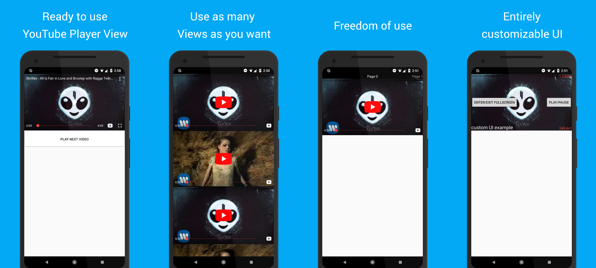
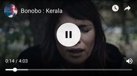
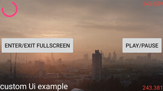
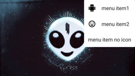

# android-youtube-player

[](https://travis-ci.com/PierfrancescoSoffritti/android-youtube-player) 
[](https://bintray.com/pierfrancescosoffritti/maven/android-youtube-player%3Acore/_latestVersion)
[](https://bintray.com/pierfrancescosoffritti/maven/android-youtube-player%3Achromecast-sender/_latestVersion)
[](https://android-arsenal.com/details/1/4322)
[](https://pierfrancescosoffritti.github.io/android-youtube-player/)

[](https://twitter.com/intent/tweet?text=A%20new%20YouTube%20Player%20library%20for%20Android%20and%20Chromecast,%20stable%20and%20customizable&url=https://github.com/PierfrancescoSoffritti/android-youtube-player&via=psoffritti&hashtags=opensource,youtubeplayer,androiddev)


android-youtube-player is a stable and customizable open source YouTube player for Android. It provides a simple View that can be easily integrated in every Activity/Fragment.

To interact with YouTube the library uses the [IFrame Player API](https://developers.google.com/youtube/iframe_api_reference), inside of a WebView, therefore the YouTube app is not required on the user's device and there are [no issues with YouTube Terms of Service](#does-this-library-breaks-youtube-terms-of-service).

The web UI of the IFrame Player player is hidden. Instead, a native UI built on top of Android is used to interact with the player, providing a native experience to the users.

The UI of the player is 100% customizable. [The default UI can be changed](#playeruicontroller), to show and hide new views, or can be [completely replaced by a custom UI](#create-your-own-custom-ui).

This library also provides a [Chromecast YouTube player](#chromecast-extension-library), that you can use to cast YouTube videos from your app to a Chromecast device.

## Why does this library exist?
The official library provided by Google to integrate YouTube videos in Android apps is the [YouTube Android Player API](https://developers.google.com/youtube/android/player/).
The official library is quite buggy ([some bugs are 5+ years old](https://code.google.com/p/gdata-issues/issues/detail?id=4395)) and lacks in support from Google. I found it to be quite unreliable and therefore unusable in production.

This, added to its limited options for customization and lack of Chromecast support, lead me to the development of this open source library.

A lengthier explanation to why you may want to consider using an alternative to the official YouTube player is written in [this Medium post](https://medium.com/@soffritti.pierfrancesco/how-to-play-youtube-videos-in-your-android-app-c40427215230).

---

A list of published apps that are using this library: ([let me know](https://github.com/PierfrancescoSoffritti/android-youtube-player/issues) if you want to add your app to this list)

- [reddit is fun](https://play.google.com/store/apps/details?id=com.andrewshu.android.reddit)
- [Shuffly](https://play.google.com/store/apps/details?id=com.pierfrancescosoffritti.shuffly)
- [Musibook](https://play.google.com/store/apps/details?id=com.spians.music.billboard)
- [Mobile Movie Database](https://play.google.com/store/apps/details?id=com.tmdb.themoviedatabase)
- [Curated](https://play.google.com/store/apps/details?id=com.rockspin.weaveapp)
- [dingo](https://play.google.com/store/apps/details?id=com.dingo)



## Does this library breaks YouTube terms of service?
**TL;DR** No. 

The library uses YouTube's own web player to play videos. Therefore it is 100% compliant with  terms of service.
[You can see here](https://developers.google.com/youtube/v3/guides/ios_youtube_helper) how this is also the official way of playing YouTube videos on iOS.

If you want to be 200% sure to be safe, [disable the native UI and enable the web player's built in web UI](#web-based-ui).

That said how you use the library matters, be sure to play videos only when the player is visible. If you follow the instructions in the documentation, the library will automatically handle this for you.

Also remember when publishing your app on the PlayStore to write title and description in a way that makes it obvious that your app doesn't have any affiliation with YouTube (the company). **This is issue has nothing to do with the library itself**, but I figured it may be useful knowledge for many of you considering to use it.

# Table of Contents (Core)
1. [Sample app](#sample-app)
2. [Download](#download)
    1. [Core](#core)
    2. [Chromecast](#chromecast)
3. [Quick start](#quick-start)
4. [API documentation](#api-documentation)
    1. [YouTubePlayerView](#youtubeplayerview)
        1. [XML attributes](#xml-attributes)
        2. [Initialization](#initialization)
        3. [IFramePlayerOptions](#iframeplayeroptions)
        4. [Full screen](#full-screen)
        5. [UI](#ui)
        6. [Release the YouTubePlayerView](#release-the-youtubeplayerview)
        7. [LifecycleObserver](#lifecycleobserver)
    2. [YouTubePlayer](#youtubeplayer)
        1. [Get a reference to YouTubePlayer](#get-a-reference-to-youtubeplayer)
        2. [Load videos](#load-videos)
            1. [Utility for loading videos](#utility-for-loading-videos)
        3. [Events](#events)
        4. [YouTubePlayerTracker](#youtubeplayertracker)
    3. [YouTubePlayerListener](#youtubeplayerlistener)
        1. [onReady callback](#onready-callback)
        2. [onStateChanged callback](#onstatechanged-callback)
    4. [PlayerUiController](#playeruicontroller)
        1. [Show video title](#show-video-title)
        2. [Live videos](#live-videos)
        3. [Custom actions](#custom-actions)
    5. [Create your own custom UI](#create-your-own-custom-ui)
        1. [Reusable UI components](#reusable-ui-components)
            1. [YouTubePlayerSeekBar](#youtubeplayerseekbar)
            2. [FadeViewHelper](#fadeviewhelper)
            3. [TimeUtilities](#timeutilities)
    6. [Web-based UI](#web-based-ui)
    7. [Menu](#menu)
        1. [YouTubePlayerMenu](#youtubeplayermenu)
        2. [MenuItem](#menuitem)
    8. [Network events](#network-events)
    9. [Chromecast support](#chromecast-support)
    10. [Useful info](#useful-info)
        1. [Hardware acceleration](#hardware-acceleration)
        2. [Play YouTube videos in the background](#play-youtube-videos-in-the-background)
        3. [minSdk](#minsdk)
        4. [How to disable share and watch later buttons](#how-to-disable-share-and-watch-later-buttons)

# Table of Contents (Chromecast)
1. [Chromecast extension library](#chromecast-extension-library)
2. [Quick start and API documentation](#quick-start---chromecast)
    1. [Download extra dependencies](#download-extra-dependencies)
    2. [Sender](#sender)
    3. [Receiver](#receiver)
    4. [Registration](#registration)
    5. [Hosting the Chromecast receiver](#hosting-the-chromecast-receiver)


# Sample app
:memo: Both the **core module** and the **chromecast module** have a sample app, to provide examples of usage of the libraries.

* [Go to source code of **core** sample app](./core-sample-app/).
* [Go to soruce code of **chromecast-sender** sample app](./chromecast-sender-sample-app).

:calling: You can also download and install the apks of both sample apps.

* [Download apk of **core** sample app](./core-sample-app/apk).
* [Download apk of **chromecast-sender** sample app](./chromecast-sender-sample-app/apk).

:eyes: If you want to know when a new release of the library is published: [watch this repository on GitHub](https://github.com/PierfrancescoSoffritti/android-youtube-player/watchers).

# Download
The Gradle dependency is available via [jCenter](https://bintray.com/pierfrancescosoffritti/maven). jCenter is the default Maven repository used by Android Studio.

The minimum API level supported by this library is API 17. Also, your app needs to be using the [androidx libraries](https://developer.android.com/jetpack/androidx/) instead of the old support libraries.

### Core
The *core* module contains the YouTube Player. It's all you need to play YouTube videos in your app.
```
dependencies {
  implementation 'com.pierfrancescosoffritti.androidyoutubeplayer:core:10.0.5'
}
```

### Chromecast
The *chromecast-sender* module contains the Chromecast YouTube Player. Use it if you need to cast YouTube videos from your app to a Chromecast device.
```
dependencies {
  implementation 'com.pierfrancescosoffritti.androidyoutubeplayer:chromecast-sender:0.23'
}
```

# Quick start
In order to start using the player you need to add a [YouTubePlayerView](#youtubeplayerview) to your layout.

```xml
<LinearLayout
    xmlns:android="http://schemas.android.com/apk/res/android"
    xmlns:app="http://schemas.android.com/apk/res-auto"
    android:layout_width="match_parent"
    android:layout_height="match_parent"
    android:orientation="vertical" >

    <com.pierfrancescosoffritti.androidyoutubeplayer.core.player.views.YouTubePlayerView
        android:id="@+id/youtube_player_view"
        android:layout_width="match_parent"
        android:layout_height="wrap_content"
        
        app:videoId="S0Q4gqBUs7c"
        app:autoPlay="true"
        app:showFullScreenButton="false" />
</LinearLayout>
```

It is recommended that you add `YouTubePlayerView` as a lifecycle observer of its parent Activity/Fragment. You can [read why in the documentation](#lifecycleobserver).

```java
YouTubePlayerView youTubePlayerView = findViewById(R.id.youtube_player_view);
getLifecycle().addObserver(youTubePlayerView);
```
*(If you have problems adding `YouTubePlayerView` as a `LifecycleObserver`, you probably aren't using androidx, [I suggest you migrate your dependencies](https://developer.android.com/jetpack/androidx/migrate))*

That's all you need, a YouTube video is now playing in your app.

If you want more control, everything can be done programmatically by getting a reference to your `YouTubePlayerView` and adding a `YouTubePlayerListener` to it.

```java
YouTubePlayerView youTubePlayerView = findViewById(R.id.youtube_player_view);
getLifecycle().addObserver(youTubePlayerView);

youTubePlayerView.addYouTubePlayerListener(new AbstractYouTubePlayerListener() {
  @Override
  public void onReady(@NonNull YouTubePlayer youTubePlayer) {
    String videoId = "S0Q4gqBUs7c";
    youTubePlayer.loadVideo(videoId, 0);
  }
});
```

----

# API documentation
The following sections provide detailed documentation for every component of the library.

If you see any problem or mistake in the documentation, feel free to contribute by opening an issue an/or sending a pull request.

## YouTubePlayerView
`YouTubePlayerView` is the access point to the YouTubePlayer.

You can add the View to your layout.

```xml
<LinearLayout
    xmlns:android="http://schemas.android.com/apk/res/android"
    android:layout_width="match_parent"
    android:layout_height="match_parent" >

    <com.pierfrancescosoffritti.androidyoutubeplayer.core.player.views.YouTubePlayerView
        android:id="@+id/youtube_player_view"
        android:layout_width="match_parent"
        android:layout_height="wrap_content"/>
</LinearLayout>
```

Or you can create it programmatically and manually add it to a ViewGroup.

```java
YouTubePlayerView youTubePlayerView = new YouTubePlayerView(this);
layout.addView(youTubePlayerView);
```

If the height of the View is set to `wrap_content`, the View will automatically have an aspect ratio of 16:9, to match the aspect ratio of most YouTube videos.

### XML attributes
If you add the view to your XML layout you have the possibility to set a few custom attributes, to customize the view's look and behavior. Everything can also be done programmatically.

- [videoId](#videoId)
- [autoPlay](#autoPlay)
- [enableAutomaticInitialization](#enableAutomaticInitialization)
- [handleNetworkEvents](#handleNetworkEvents)
- [useWebUi](#useWebUi)
- [enableLiveVideoUi](#enableLiveVideoUi)
- [showYouTubeButton](#showYouTubeButton)
- [showFullScreenButton](#showFullScreenButton)
- [showVideoCurrentTime](#showVideoCurrentTime)
- [showVideoDuration](#showVideoDuration)
- [showSeekBar](#showSeekBar)

#### videoId
This attribute expects a `String`, which is the id of a YouTube video.

**If set**, the player will automatically start playing the video.

**If not set**, the player won't automatically play.

In general you should use this attribute if you want your player to play only one video. This is not a rule, just best practice. In fact, even if you set the attribute it is still possible to play other videos programatically.

#### autoPlay
This attribute expects a `boolean`. Its default value is `false`.

**If `true`**, the player start playing the video provided with `videoId` without waiting for user input.

**If `false`**, the player will wait for user input before playing the video provided with `videoId`.

If `videoId` is not set, this attribute is useless, therefore if it is set to `true` `YouTubePlayerView` will throw an exception.

`autoPlay` won't work if `YouTubePlayerView` is not [added as a `LifecycleObserver` of its parent Activity/Fragment](#lifecycleobserver).

#### enableAutomaticInitialization
This attribute expects a `boolean`. Its default value is `true`.

**If `true`**, `YouTubePlayerView` will take care of its initialization.

**If `false`**, you will have to initialize `YouTubePlayerView` programmatically.

In general it makes sense to leave this attribute to `true`. You may want to set it to `false` only if you need to initialize the view using [`IFramePlayerOptions`](#iframeplayeroptions).

#### handleNetworkEvents
This attribute expects a `boolean`. Its default value is `true`.

**If `true`**, `YouTubePlayerView` handle network events by registering a `NetworkReceiver`.

**If `false`**, you will be responsible for handling network events.

It is useful to have this attribute set to `true` so that if the connection drops while the player is initializing `YouTubePlayerView` will be able to resume the initialization automatically once the network is back.

If you decide to set it to `false` you should also disable `enableAutomaticInitialization` and manage network events on your own.

Read more about network events [here](#network-events).

#### useWebUi
This attribute expects a `boolean`. Its default value is `false`.

**If `true`**, `YouTubePlayerView` will use the web-based UI of the IFrame YouTubePlayer.

**If `false`**, `YouTubePlayerView` will use the native UI of the library.

YouTube added some non-removable buttons to the IFrame Player, as mentioned in [this issue](https://github.com/PierfrancescoSoffritti/android-youtube-player/issues/242). Using the web-based UI is the only way to have access to these non-removable buttons.

Read the documentation of the [`initializeWithWebUi`](#initializeWithWebUi(YouTubePlayerListener,-boolean)) method to learn more about the effects of this attribute.

*Web UI screenshot:*



#### enableLiveVideoUi
This attribute expects a `boolean`. Its default value is `false`.

**If `true`**, `YouTubePlayerView` will use UI for live videos.

**If `false`**, `YouTubePlayerView` will use the UI normal videos.

This attribute does nothing if `useWebUi` is `true`.

*Live UI screenshot:*


#### showYouTubeButton
This attribute expects a `boolean`. Its default value is `true`.

**If `true`**, `YouTubePlayerView` will show a small clickable YouTube icon in the lower right corner of the player.

**If `false`**, `YouTubePlayerView` will not show a small clickable YouTube icon in the lower right corner of the player.

This attribute does nothing if `useWebUi` is `true`.

#### showFullScreenButton
This attribute expects a `boolean`. Its default value is `true`.

**If `true`**, `YouTubePlayerView` will show a button to enter and exit full-screen.

**If `false`**, `YouTubePlayerView` will not show a button to enter and exit full-screen.

This attribute does nothing if `useWebUi` is `true`.

#### showVideoCurrentTime
This attribute expects a `boolean`. Its default value is `true`.

**If `true`**, `YouTubePlayerView` will show the current time of the current video.

**If `false`**, `YouTubePlayerView` will not show the current time of the current video.

This attribute does nothing if `useWebUi` is `true`.

#### showVideoDuration
This attribute expects a `boolean`. Its default value is `true`.

**If `true`**, `YouTubePlayerView` will show the time duration of the current video.

**If `false`**, `YouTubePlayerView` will not show the time duration of the current video.

This attribute does nothing if `useWebUi` is `true`.

#### showSeekBar
This attribute expects a `boolean`. Its default value is `true`.

**If `true`**, `YouTubePlayerView` will show a SeekBar to control video playback.

**If `false`**, `YouTubePlayerView` will not show a SeekBar to control video playback.

This attribute does nothing if `useWebUi` is `true`.

### Initialization
If you need to initialize `YouTubePlayerView` programmatically, you can set its xml attribute `enableAutomaticInitialization` to false.
You can do the same programmatically by calling `youTubePlayerView.setEnableAutomaticInitialization(false)`.

After automatic initialization has been disabled, you need to take care of the initialization of `YouTubePlayerView`.

You can use these methods:
```java
YouTubePlayerView.initialize(YouTubePlayerListener listener)
```
```java
YouTubePlayerView.initialize(YouTubePlayerListener listener, boolean handleNetworkEvents)
```
```java
YouTubePlayerView.initializeWithWebUi(YouTubePlayerListener listener, boolean handleNetworkEvents)
```
```java
YouTubePlayerView.initialize(YouTubePlayerListener listener, boolean handleNetworkEvents, IFramePlayerOptions iframePlayerOptions)
```
#### `initialize(YouTubePlayerListener)`
Initialize the `YouTubePlayer`. Network events are automatically handled by the player.

The argument is a `YouTubePlayerListener`, you can read more about it [here](#youtubeplayerlistener).

#### `initialize(YouTubePlayerListener, boolean)`
Initialize the `YouTubePlayer`. By using the `boolean` is possible to decide if the player should handle network events or not, read more about network events [here](#network-events).

#### `initialize(YouTubePlayerListener, boolean, IFramePlayerOptions)`
By passing an `IFramePlayerOptions` to the initialize method it is possible to set some of the parameters of the IFrame YouTubePlayer. Read more about `IFramePlayerOptions` [here](#iframeplayeroptions).

All the possible parameters and values are listed [here](https://developers.google.com/youtube/player_parameters#Parameters). Not all of them are supported in this library because some don't make sense in this context. [Open an issue](https://github.com/PierfrancescoSoffritti/android-youtube-player/issues) if you need a parameter that is not currently supported.

#### `initializeWithWebUi(YouTubePlayerListener, boolean)`
This method is identical to `initialize(YouTubePlayerListener, boolean)` but it disables the native UI of the player and instead uses the web-based UI of the IFrame Player API.

Because the native UI is disabled trying to call `YouTubePlayerView.getPlayerUiController()` will throw an exception.

YouTube added some non-removable buttons to the IFrame Player, as mentioned in [this issue](https://github.com/PierfrancescoSoffritti/android-youtube-player/issues/242). Using the web-based UI is the only way to have access to these non-removable buttons.

### IFramePlayerOptions
The `IFramePlayerOptions` is an optional argument that can be passed to `YouTubePlayerView.initialize(YouTubePlayerListener, boolean, IFramePlayerOptions)`, it can be used to set some of the parameters of the IFrame YouTubePlayer.

A simple example of how to use `IFramePlayerOptions` can be found in the sample app [here](./core-sample-app/src/main/java/com/pierfrancescosoffritti/androidyoutubeplayer/core/sampleapp/examples/iFramePlayerOptionsExample/IFramePlayerOptionsExampleActivity.java).

Use the Builder to get a `IFramePlayerOptions` object.

```java
IFramePlayerOptions iFramePlayerOptions = new IFramePlayerOptions.Builder()
  .controls(1)
  .build();
```

All the possible parameters and values are listed [here](https://developers.google.com/youtube/player_parameters#Parameters). Not all of them are supported in this library because some don't make sense in this context. [Open an issue](https://github.com/PierfrancescoSoffritti/android-youtube-player/issues) if you need a parameter that is not currently supported.

#### Supported options

##### `controls`
This option indicates whether the web-based UI of the IFrame player should be hidden or visible.

If set to 0: web UI is not visible.

If set to 1: web UI is visible.

##### `rel`
This option controls the related videos shown at the end of a video.

If set to 0: related videos will come from the same channel as the video that was just played.

If set to 1: related videos will come from multiple channels.

##### `ivLoadPolicy`
This option controls video annotations.

If set to 1: the player will show annotations.

If set to 3: the player won't show annotations.

##### `ccLoadPolicy`
This option controls video captions. It doesn't work with automatically generated captions.

If set to 0: the player will show captions.

If set to 1: the player won't show captions.

### Full screen
You can use the `YouTubePlayerView` to enter and exit full-screen.

```java
youTubePlayerView.enterFullScreen();
youTubePlayerView.exitFullScreen();
youTubePlayerView.isFullScreen();
youTubePlayerView.toggleFullScreen();
```

You can also add listeners to get notified when the `YouTubePlayerView` enters or exits full-screen.

```java
youTubePlayerView.addFullScreenListener(YouTubePlayerFullScreenListener fullScreenListener);
youTubePlayerView.removeFullScreenListener(YouTubePlayerFullScreenListener fullScreenListener);
```

`enterFullScreen()` and `exitFullScreen()` will:
- set `YouTubePlayerView`'s height and width to `MATCH_PARENT`
- update the UI of the player to match the new state. (eg: update the full-screen button)

It is responsibility of the developer to hide other Views in the Activity, change the orientation of the Activity etc. The sample app contains an [helper class](./core-sample-app/src/main/java/com/pierfrancescosoffritti/androidyoutubeplayer/core/sampleapp/utils/FullScreenHelper.java) that can help you to update your app state, but this is not part of the library.

If you need to change the orientation of your Activity/Fragment, remember that by default Android recreates Activities and Fragments when the orientation changes. Make sure that you manually handle orientation changes by adding the attribute `android:configChanges` to your Activity definition in the manifest.

```xml
<application >
  <activity
    android:configChanges="orientation|screenSize|keyboardHidden|smallestScreenSize|screenLayout" />
</application>
```

### UI
If you want to interact with the UI of the player you need to get a reference to the `PlayerUiController` from the `YouTubePlayerView` by calling this method

```java
PlayerUiController YouTubePlayerView.getPlayerUiController();
```

[Read the documentation of PlayerUiController](#playeruicontroller).

### Release the YouTubePlayerView
Remember to release the `YouTubePlayerView` when you're done using it, by calling `YouTubePlayerView.release()`.

```java
@Override
public void onDestroy() {
    super.onDestroy();
    youTubePlayerView.release();
}
```

**You don't need to manually release the player if you registered it as an observer of your Activity/Fragment's lifecycle.**

### LifecycleObserver
`YouTubePlayerView` implements the `LifecycleObserver` interface, this means that it is a lifecycle aware component.

If added as an observer of your Activity/Fragment's lifecycle, `YouTubePlayerView` will be smarter. **It is highly recommended that you register `YouTubePlayerView` as a `LifecycleObserver`.**

```java
lifecycleOwner.getLifecycle().addObserver(youTubePlayerView);
```
Adding `YouTubePlayerView` as an observer to a lifecycle will allow `YouTubePlayerView` to automatically pause the playback when the Activity/Fragment stops (not when it pauses, in order to support multi-window applications).


If you want your app to keep [playing when the Activity/Fragment is not visible](#play-youtube-videos-in-the-background) (remember that this behavior is not allowed, if you want to publish your app on the PlayStore), don't register the `YouTubePlayerView` as a lifecycle observer. But remember to manually call `release()` when the Activity/Fragment is being destroyed.

## YouTubePlayer
`YouTubePlayer` is the component responsible for controlling the playback of YouTube videos. You can see its contract [here](./core/src/main/java/com/pierfrancescosoffritti/androidyoutubeplayer/core/player/YouTubePlayer.kt).

Every [`YouTubePlayerView`](#youtubeplayerview) contains a `YouTubePlayer`.

### Get a reference to YouTubePlayer
There are two ways to get a reference to the `YouTubePlayer`, through the `YouTubePlayerView`.

#### 1. YouTubePlayerView.getYouTubePlayerWhenReady
`YouTubePlayerView.getYouTubePlayerWhenReady` can be used to get a reference to the `YouTubePlayer`. As the name of the method says, you'll only get the player when it is ready.

Therefore this function takes a callback as argument, the callback will be called when the `YouTubePlayer` is ready.

```java
youTubePlayerView.getYouTubePlayerWhenReady(youTubePlayer -> { 
  // do stuff with it
})
```

#### 2. YouTubePlayerListener
Every method of a [`YouTubePlayerListener`](#youtubeplayerlistener) has the `YouTubePlayer` as argument.

### Load videos
To load a video you can use two methods.

```java
YouTubePlayer.loadVideo(String videoId, float startTime)
```
or
```java
YouTubePlayer.cueVideo(String videoId, float startTime)
```
The difference between the two is that `loadVideo` loads and automatically plays the video, while `cueVideo` just loads video and thumbnail but doesn't autoplay.

#### Utility for loading videos
If the Activity/Fragment is in the background, but you created a `YouTubePlayerListener` that calls `loadVideo` when `onReady` is called, the video will start playing even if the Activity is in the background.

To solve this problem you should use the `loadOrCueVideo` function.

Provided as an utility function in Java.

```java
YouTubePlayerUtils.loadOrCueVideo(
  youTubePlayer,
  getLifecycle(),
  videoId,
  startTime
);
```

And as an extension function in Kotlin.

```kotlin
youTubePlayer.loadOrCueVideo(lifeCycle, videoId, startTime)
```

This function will call `loadVideo` only if the Activity is resumed, otherwise it will call `cueVideo`, so that the video starts loading but not playing.

### Events
During its existence the player will constantly emit events, you can easily listen to all of them by adding a [`YouTubePlayerListener`](#youtubeplayerlistener) to it.

### YouTubePlayerTracker
`YouTubePlayerTracker` is an utility provided by the library to easily keep track of a `YouTubePlayer`'s state and other information.

`YouTubePlayerTracker` is a [`YouTubePlayerListener`](#youtubeplayerlistener), therefore in order to use it you need to add it as a listener to the `YouTubePlayer`.

You can then use the tracker to get the player's state and various information about the video that is being played.

```java
YouTubePlayerTracker tracker = new YouTubePlayerTracker();
youTubePlayer.addListener(tracker);

tracker.getState();
tracker.getCurrentSecond();
tracker.getVideoDuration();
tracker.getVideoId();
```

## YouTubePlayerListener
A `YouTubePlayerListener` is used to intercept events emitted by a [`YouTubePlayer`](#youtubeplayer).

During its existence a `YouTubePlayer` will constantly emit events, you can listen to them by adding a `YouTubePlayerListener` to it.

```java
youTubePlayer.addListener(YouTubePlayerListener listener);
youTubePlayer.removeListener(YouTubePlayerListener listener);
```
These are the method that a `YouTubePlayerListener` must implement, every method takes a reference to the `YouTubePlayer` and some other arguments.

```java
// Called when the player is ready to play videos.
// You should start using the player only after this method is called.
void onReady(@NonNull YouTubePlayer youTubePlayer)

// Called every time the state of the player changes.
void onStateChange(@NonNull YouTubePlayer youTubePlayer, @NonNull PlayerConstants.PlayerState state)

// Called every time the quality of the playback changes.
void onPlaybackQualityChange(@NonNull YouTubePlayer youTubePlayer, @NonNull PlayerConstants.PlaybackQuality playbackQuality)

// Called every time the speed of the playback changes.
void onPlaybackRateChange(@NonNull YouTubePlayer youTubePlayer, @NonNull PlayerConstants.PlaybackRate playbackRate)

// Called when an error occurs in the player.
void onError(@NonNull YouTubePlayer youTubePlayer, @NonNull PlayerConstants.PlayerError error)

// Called periodically by the player, the argument is the number of seconds that have been played.
void onCurrentSecond(@NonNull YouTubePlayer youTubePlayer, float second)

// Called when the total duration of the video is loaded.
// Note that getDuration() will return 0 until the video's metadata is loaded, which normally happens just after the video starts playing.
void onVideoDuration(@NonNull YouTubePlayer youTubePlayer, float duration)

// Called periodically by the player, the argument is the percentage of the video that has been buffered.
void onVideoLoadedFraction(@NonNull YouTubePlayer youTubePlayer, float loadedFraction)

// Called when the id of the current video is loaded
void onVideoId(@NonNull YouTubePlayer youTubePlayer, String videoId)

void onApiChange(@NonNull YouTubePlayer youTubePlayer)
```

If you don't want to implement all the methods of this interface, you can extend `AbstractYouTubePlayerListener` instead of implementing `YouTubePlayerListener` and override only the methods you are interested in.

For more information on the methods defined in the `YouTubePlayerListener` interface, please refer to the documentation defined above each method [in the codebase](./core/src/main/java/com/pierfrancescosoffritti/androidyoutubeplayer/core/player/listeners/YouTubePlayerListener.kt).

### onReady callback
The onReady callback of a `YouTubePlayerListener` is called once, when the `YouTubePlayer` is ready to be used for the first time. **You can't use a `YouTubePlayer` before it is ready**.

### onStateChanged callback
The `YouTubePlayer` has a state, that changes accordingly to the playback changes. The [list of possible states](./core/src/main/java/com/pierfrancescosoffritti/androidyoutubeplayer/core/player/PlayerConstants.kt) is the same of the YouTube [IFrame Player API](https://developers.google.com/youtube/iframe_api_reference#Playback_status).

```
UNKNOWN
UNSTARTED
ENDED
PLAYING
PAUSED
BUFFERING
VIDEO_CUED
```

## PlayerUiController
The `PlayerUiController` is responsible for controlling the UI of a [`YouTubePlayerView`](#youtubeplayerview).

You can get a reference to the `PlayerUiController` from the `YouTubePlayerView`

```java
youTubePlayerView.getPlayerUiController();
```

`PlayerUiController` offers a lot of method to control the UI, only a few of them are presented in the following sections.

### Show video title
Due to changes to the IFrame API, the web-based IFrame player will always show the title of the video.

Nevertheless, the `PlayerUiController` exposes a method called `setVideoTitle(String videoTitle)` that can be used to set the title on the Android side (unfortunately setting this title won't remove the title from the WebView).

### Live videos
If you want to play live videos you must setup the UI accordingly, by calling this method.

```java
PlayerUiController.enableLiveVideoUi(boolean enable);
```

Unfortunately there is no way for the player to automatically know if it is playing a live video or not, therefore is up to the developer to change the UI.

You can obtain the same result by setting the xml attribute `app:enableLiveVideoUi="true"` of `YouTubePlayerView`.

*Live-ui screenshot:*


### Custom actions
You can set custom actions on the right and left side of the Play/Pause button of the player

```java
PlayerUiController.setCustomAction1(Drawable icon, OnClickListener listener);
PlayerUiController.setCustomAction2(Drawable icon, OnClickListener listener);
PlayerUiController.showCustomAction1(boolean show);
PlayerUiController.showCustomAction2(boolean show);
```
*Custom actions example:*


You can **also add any type of View to the UI**, this can be useful if you want to add a new icon.

```java
PlayerUiController.addView(View view);
PlayerUiController.removeView(View view);
```

The View will be added to the top corner of the player.

*Example of views added to the player (see Chromecast icon in the top-right corner):*


## Create your own custom UI
Customization is an important aspect of this library. If need to, you can completely replace the default UI of the player.

`YouTubePlayerView` has method for that. 

```java
View inflateCustomPlayerUi(@LayoutRes int customUiLayoutID)
```

This method takes in the `id` of a layout resource, which is a regular XML file containing the definition of a layout. The default UI of the player is removed and replaced with the new UI. The method returns the View object corresponding to the newly inflated layout.

After calling this method, the default [PlayerUiController](#playeruicontroller) won't be available anymore. Calling `YouTubePlayerView.getPlayerUiController()` will throw an exception.

You are now responsible for managing your custom UI with your own code. Meaning: you should write your own class to manage the UI. A simple but complete example can be seen [here, in the sample app](./core-sample-app/src/main/java/com/pierfrancescosoffritti/androidyoutubeplayer/core/sampleapp/examples/customUiExample), I recommend taking a few minutes to read it, it should be trivial to understand.

Example (taken from sample app):

```java
View customPlayerUi = youTubePlayerView.inflateCustomPlayerUi(R.layout.custom_player_ui);

youTubePlayerView.addYouTubePlayerListener(new AbstractYouTubePlayerListener() {
  @Override
  public void onReady(@NonNull YouTubePlayer youTubePlayer) {
    YourCustomPlayerUiController customPlayerUiController = new YourCustomPlayerUiController(youTubePlayer, youTubePlayerView, customPlayerUi, ...);
    youTubePlayer.addListener(customPlayerUiController);
    youTubePlayerView.addFullScreenListener(customPlayerUiController);

    // ...
  }
});

```
A blog post going deeper on this is available [at this link](https://medium.com/@soffritti.pierfrancesco/customize-android-youtube-players-ui-9f32da9e8505).

*Example of a custom UI: (this is just a ugly example, but here your design skills are the limit :))*



### Reusable UI components
The library provides some pre-built UI components, these components are useful to reduce the time needed to build your own UI and controllers.

#### YouTubePlayerSeekBar
This component is useful to display and control the time of the playback. It shows the current time, the total duration of the video and a seek bar.


You can add it to your layout programmatically or in your xml.

```xml
<com.pierfrancescosoffritti.androidyoutubeplayer.core.ui.views.YouTubePlayerSeekBar
  android:id="@+id/youtube_player_seekbar"
  android:layout_width="match_parent"
  android:layout_height="wrap_content"

  app:fontSize="12sp"
  app:color="@color/red" />
```
It is possible to change font size and color by using the `fontSize` and `color` attributes.

`YouTubePlayerSeekBar` implements `YouTubePlayerListener`. In order for it to work you need to add it as a listener to your `YouTubePlayer` object.

```java
youTubePlayer.addListener(youTubePlayerSeekBar);
```

You may wan to listen to events from `YouTubePlayerSeekBar`, in order to update the current time of your `YouTubePlayer` when the user moves the touch bar. To do that pass a `YouTubePlayerSeekBarListener` to `YouTubePlayerSeekBar`.

```java
youTubePlayerSeekBar.setYoutubePlayerSeekBarListener(new YouTubePlayerSeekBarListener() {
  @Override
  public void seekTo(float time) {
    youTubePlayer.seekTo(time);
  }
});
```

#### FadeViewHelper
An helper class that automatically fades out a view when not used. It can be used to automate the fade in and out of a container for the player controls, so that they automatically fade when appropriate.

The `FadingFrameLayout` is a `YouTubePlayerListener` therefore it can change it's behavior based on the state of the player. For example: if the video is paused it won't automatically fade out.

You can initialize it by passing to the constructor the view you want to be fading.

```java
FadeViewHelper fadeViewHelper = new FadeViewHelper(controlsContainer);
```

It is possible to change the animation duration and fade out delay by using the setter methods.

```java
fadeViewHelper.setAnimationDuration(FadeViewHelper.DEFAULT_ANIMATION_DURATION);
fadeViewHelper.setFadeOutDelay(FadeViewHelper.DEFAULT_FADE_OUT_DELAY);
```
They both take the time in milliseconds.

In order for `FadeViewHelper` to work properly you need to add it as a listener to your `YouTubePlayer` object.

```java
youTubePlayer.addListener(fadeViewHelper);
```
Use the method `FadeViewHelper.setDisabled(boolean)` to disable the automatic fading.

Use the method `FadeViewHelper.toggleVisibility()` to toggle the visibility of the target view, with a fade animation.

#### TimeUtilities
A set of utilities than can be used to format time Strings (like duration and current time of videos).

```java
String TimeUtilities.formatTime(float timeInSeconds)
```
Takes in the time in seconds and returns a String with the time formatted as "M:SS". (M = minutes, S = seconds).

## Web based UI
YouTube added some non-removable buttons to the IFrame Player, as mentioned in [this issue](https://github.com/PierfrancescoSoffritti/android-youtube-player/issues/242). Using the web-based UI is the only way to have access to these non-removable buttons.

To use the web-based UI you can set the attribute `app:useWebUi="true"` in the `YouTubePlayerView`.

```xml
<com.pierfrancescosoffritti.androidyoutubeplayer.core.player.views.YouTubePlayerView
  android:id="@+id/youtube_player_view"
  android:layout_width="match_parent"
  android:layout_height="wrap_content"

  app:useWebUi="true" />
```

Or you can use [the appropriate initialization method](#initialization).

```java
YouTubePlayerView.initializeWithWebUi(YouTubePlayerListener listener, boolean handleNetworkEvents)
```

When using the web-based UI, calling `YouTubePlayerView.getPlayerUiController()` throws exception and it is not possible to apply any UI customization.

*This is how the player will look when using the web-based ui:*


## Menu
`PlayerUiController` has an optional menu. You can use these methods to control the menu's behavior:

``` java
PlayerUiController.showMenuButton(boolean show);
PlayerUiController.setMenuButtonClickListener(@NonNull View.OnClickListener customMenuButtonClickListener);
```

By default the menu icon is not visible. 

The default `OnClickListener` opens the menu when the menu icon is clicked. You can change this behaviour, for example to open a menu with a different UX, like a bottom sheet panel. Obviously if you want a UX different from the one provided by the library, you are responsible for creating your own components.

*Menu screenshot:*



### YouTubePlayerMenu
You can get a reference of the `YouTubePlayerMenu` from the `PlayerUiController`.
```java
YouTubePlayerMenu PlayerUiController.getMenu()
```
Once you get a `YouTubePlayerMenu` object you can add and remove items to it, show it and dismiss it.

```java
YouTubePlayerMenu addItem(MenuItem menuItem)
YouTubePlayerMenu removeItem(MenuItem menuItem)
YouTubePlayerMenu removeItem(int itemIndex)

void show(View anchorView)
void dismiss()
```

Initially the `YouTubePlayerMenu` doesn't contain any item. You need to add them.

### MenuItem
`MenuItem`s are the items of the `YouTubePlayerMenu`. They have a title, an optional icon and a `OnClickListener` that is called when the item is clicked.

## Network events
[`YouTubePlayerView`](#youtubeplayerview) automatically handles network events, using an internal BroadcastReceiver. You can choose to enable or disable this feature [when initializing the player](#initialization), or by setting the xml attribute `app:handleNetworkEvents="false"`.

Using the internal BroadcastReceiver is the easiest and recommended way to handle network events. The library is capable of handling cases in which the connection goes off and the playback can't continue, or cases in which the connection goes off while the player is in the process of initialization.

If you want to use your own BroadcastReceiver make sure to cover all the possible scenarios, in order to provide a good user experience.

## Chromecast support
If you need to cast YouTube videos to a Chromecast device you can use the *chromecast-sender* extension library. Read its documentation [here](#chromecast-extension-library).

## Useful info
### Hardware acceleration
Is important that the Activity containing the [YouTubePlayerView](#youtubeplayerview) is hardware accelerated. This option is enabled by default, you don't have to change anything in your app. Unless you manually disabled hardware acceleration.

If you need to disable hardware acceleration in your application, you can enable it at the Activity level, only for the Activity containing the `YouTubePlayerView`, as explained [here](https://developer.android.com/guide/topics/graphics/hardware-accel.html).

Disabling hardware acceleration on the Activity containing `YouTubePlayerView` may result in some weird behavior. The one I have observed so far shows a black image in the player, while the audio is playing normally.

### Play YouTube videos in the background
With this library it's easy to play YouTube videos when the app is not visible. In order to do that you simply have to not call `youTubePlayer.pause()` when the Activity is being paused or stopped and enable background playback by calling `YouTubePlayerView.enableBackgroundPlayback(true)`.

Adding `YouTubePlayerView` as an [observer to a lifecycle](#lifecycleobserver) will automatically cause the player to pause the playback when the Activity/Fragment stops.

Therefore if you want your app to keep playing even when the Activity/Fragment is paused/stopped, don't register it as a lifecycle observer and enable background playback for the view. But remember to manually call `YouTubePlayerView.release()` when the Activity/Fragment is destroyed.

Remember that this behavior is against [YouTube terms of service](https://developers.google.com/youtube/terms/api-services-terms-of-service), therefore if you decide to allow background playback you won't be able to publish your app on the Play Store.

Use this functionality only if you plan to build the app for personal use or if you plan to distribute it through different channels.

### minSdk
The minSdk of the library is 17. [At this point in time](https://developer.android.com/about/dashboards/index.html) it doesn't make much sense for new apps to support older versions of Android.

I'm not sure how WebView will behave on older versions of Android, but technically it should be possible to lower the minSdk. If you absolutely need to support older devices, I suggest you fork the library and lower the minSdk yourself.

### How to disable share and watch later buttons
YouTube made some changes to the IFrame player, unfortunately it's not possible to remove those buttons.

If you want to be able to click them, you should [use the web-based UI](#web-based-ui) of the player instead of the native UI.

*Watch later and share button are in the top right corner, they are visible when the ui is visible:*


---

# Chromecast extension library


The *chromecast-sender* extension library extends the *core* library with chromecast functionalities. It shares some interfaces with the *core* library, therefore they can be used together.

The scope of this library is to provide the basic framework and utilities needed to cast YouTube videos to a Chromecast device.

**The api of this library is not 100% finalized yet, but is stable. You can use it in your apps.**

# Quick start - Chromecast
A Google Cast application is made of two components: a Sender and a Receiver.

* [Sender](#sender): is responsible for initiating the cast sessions. In our case the sender is an Android app.
* [Receiver](#receiver): a web app that gets downloaded on the Chromecast when a sender initiates a cast sessions.

### Download extra dependencies
To use Google Cast functionalities add the *chromecast-sender* module to your dependencies:

[last-version](#download).

```
implementation 'com.pierfrancescosoffritti.androidyoutubeplayer:chromecast-sender:last-version'

// this is not needed to use the library, but it provides the quite useful cast button.
implementation 'androidx.mediarouter:mediarouter:last-version'
```

### Sender
In order to use the Google Cast framework an app has to declare a `OptionsProvider`, as described in the [Google Cast documentation](https://developers.google.com/cast/docs/android_sender_integrate#initialize_the_cast_context).

Add this class to your project:
```java
public final class CastOptionsProvider implements com.google.android.gms.cast.framework.OptionsProvider {
  public com.google.android.gms.cast.framework.CastOptions getCastOptions(Context appContext) {

  // Register you custom receiver on the Google Cast SDK Developer Console to get this ID.
  String receiverId = "";

  return new com.google.android.gms.cast.framework.CastOptions.Builder()
    .setReceiverApplicationId(receiverId)
    .build();
  }

  public List<SessionProvider> getAdditionalSessionProviders(Context context) {
    return null;
  }
}
```
You can read how to get a `receiverId` [here](#registration).

Add the `OptionsProvider` to your `manifest.xml`file.

*(`OPTIONS_PROVIDER_CLASS_NAME` is meant to be like that, change only the `android:value` attribute)*
```xml
<meta-data
  android:name="com.google.android.gms.cast.framework.OPTIONS_PROVIDER_CLASS_NAME"
  android:value="yourpackagename.CastOptionsProvider" />
```

Add a MediaRouterButton to your layout, in your xml file or programmatically.
```xml
<LinearLayout
  xmlns:android="http://schemas.android.com/apk/res/android"
  android:id="@+id/root"
  android:layout_width="match_parent"
  android:layout_height="match_parent"
  android:orientation="vertical" >

  <androidx.mediarouter.app.MediaRouteButton
    android:id="@+id/media_route_button"
    android:layout_width="wrap_content"
    android:layout_height="wrap_content" />
</LinearLayout>
```

Then in your Activity/Fragment get a reference to the `MediaRouteButton` and check the status of the GooglePlayServices on the user's phone.
```java
private int googlePlayServicesAvailabilityRequestCode = 1;

@Override
protected void onCreate(Bundle savedInstanceState) {
  super.onCreate(savedInstanceState);
  setContentView(R.layout.activity_main);

  androidx.mediarouter.app.MediaRouteButton mediaRouteButton = findViewById(R.id.media_route_button);
  CastButtonFactory.setUpMediaRouteButton(this, mediaRouteButton);

  // can't use CastContext until I'm sure the user has GooglePlayServices
  PlayServicesUtils.checkGooglePlayServicesAvailability(this, googlePlayServicesAvailabilityRequestCode, this::initChromecast);
}

@Override
public void onActivityResult(int requestCode, int resultCode, Intent data) {
  super.onActivityResult(requestCode, resultCode, data);

  // can't use CastContext until I'm sure the user has GooglePlayServices
  if(requestCode == googlePlayServicesAvailabilityRequestCode)
    PlayServicesUtils.checkGooglePlayServicesAvailability(this, googlePlayServicesAvailabilityRequestCode, this::initChromecast);
}

private void initChromecast() {
  new ChromecastYouTubePlayerContext(
    CastContext.getSharedInstance(this).getSessionManager(),
    new SimpleChromecastConnectionListener()
  );
}

```
You can easily check the GooglePlayServices status by using `PlayServicesUtils.checkGooglePlayServicesAvailability`, a utility function provided by the *chromecast-sender* library.

`PlayServicesUtils.checkGooglePlayServicesAvailability` does what is described [here, in the official doc](https://developers.google.com/android/guides/setup#ensure_devices_have_the_google_play_services_apk). It will check the status of GooglePlayServices and will show a dialog to the user if some action is needed in order to fix the problem. It won't display anything if everything is ok (which it is, 99% of the cases), in this case it will simply call the function passed as third parameter.
If there are some problems, the result of the operation is delivered through the `onActivityResult` callback.

Once you're sure the user's GooglePlayServices is all right, you can create the `ChromecastYouTubePlayerContext`. The access point to the *chromecast-sender* library.

`ChromecastYouTubePlayerContext` is the entry point to the *chromecast-sender* library. Once it is created, it automatically starts listening for Chromecast connection events. The `ChromecastConnectionListener` passed to the constructor will be used to do just that.

When a user clicks the `MediaRouteButton` a series of events will be triggered in the framework, use `ChromecastConnectionListener`'s callbacks to be notified of these events.

```java
private class SimpleChromecastConnectionListener implements ChromecastConnectionListener {

  @Override
  public void onChromecastConnecting() {
    Log.d(getClass().getSimpleName(), "onChromecastConnecting");
  }

  @Override
  public void onChromecastConnected(@NonNull ChromecastYouTubePlayerContext chromecastYouTubePlayerContext) {
    Log.d(getClass().getSimpleName(), "onChromecastConnected");
    initializeCastPlayer(chromecastYouTubePlayerContext);
  }

  @Override
  public void onChromecastDisconnected() {
    Log.d(getClass().getSimpleName(), "onChromecastDisconnected");
  }

  private void initializeCastPlayer(ChromecastYouTubePlayerContext chromecastYouTubePlayerContext) {
    chromecastYouTubePlayerContext.initialize(new AbstractYouTubePlayerListener() {
      @Override
      public void onReady(@NonNull YouTubePlayer youTubePlayer) {
        youTubePlayer.loadVideo("S0Q4gqBUs7c", 0f);
      }
    });
  }
}
```

Only after a Chromecast connection has been established you can initialize the `ChromecastConnectionListener`.

From now on it will be the same as using a local `YouTubePlayer`. As you can see in the example, you need to call `ChromecastYouTubePlayerContext.initialize`, providing a `YouTubePlayerListener`.

The `YouTubePlayerListener` will notify you of changes in the playback.
You can call `loadVideo`, `cueVideo`, `pause`, `play` etc.. on the `YouTubePlayer` object as you're used to, the library will take care of the communication with the Google Cast device.

For how to use the `YouTubePlayer` object and `YouTubePlayerListener`, you can refer to the documentation for the *core* library, [YouTubePlayer](#youtubeplayer).

This example can be found [in the chromecast-sender sample app](./chromecast-sender-sample-app/src/main/java/com/pierfrancescosoffritti/androidyoutubeplayer/chromecast/sampleapp/examples/basicExample/BasicExampleActivity.kt), written in Kotlin and in the [core sample app](./core-sample-app/src/main/java/com/pierfrancescosoffritti/androidyoutubeplayer/core/sampleapp/examples/chromecastExample/), wirtten in Java.

*Screenshot of the CastButton added to the YouTubePlayerView:*


### Receiver
This library requires a custom receiver, you can find the source code of the *chromecast-receiver* [here](./chromecast-receiver).

You don't need to change anything here, it just works.
Take this code and upload it (as it is) on your server. (Read the [hosting paragraph](#hosting-the-chromecast-receiver) to learn more about hosting).

### Registration
In order to use your receiver you need a receiverId. This is the ID of your receiver app. To get a receiver ID you need to register your receiver on the Google Cast SDK developer console, you can learn how to do it by reading the [official documentation](https://developers.google.com/cast/docs/registration). Rember to register a **Custom Receiver**, this is the type of receiver you need for this library.

### Hosting the chromecast-receiver
You will be required to host your receiver somewhere, host it where you prefer. Firebase free hosting may be a good option, for development.

---

For any question feel free to [open an issue on the GitHub repository](https://github.com/PierfrancescoSoffritti/android-youtube-player/issues).
